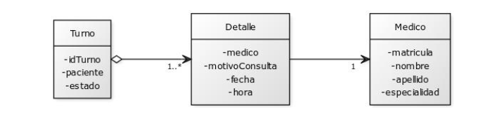
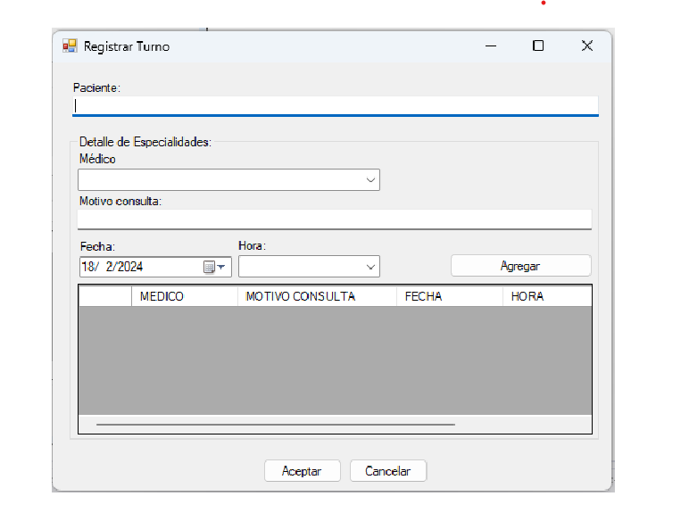

# 📋 Sistema de Gestión de Turnos - Consultorio Médico

## 🎯 Objetivo de la Actividad

Desarrollar una aplicación web API que permita gestionar la reserva de turnos en un consultorio médico, implementando arquitectura en capas y validaciones de negocio.

## 📊 Tabla de Puntajes

| Criterio | Puntaje |
|----------|---------|
| **Modelo de objetos y capa de acceso a datos con procedimientos almacenados o lógica en capa de datos** | 40 |
| **Opción A) WebAPI con endpoints indicados** | 60 |
| **Opción B) Carga combo** | 10 |
| **Validación de médico repetido para fecha seleccionada** | 10 |
| **Validación de turno disponible para día y hora seleccionados** | 10 |
| **Botón Agregar** | 10 |
| **Botón Quitar** | 10 |
| **Botón Aceptar** | 10 |
| **Total** | **100** |

## 🏗️ Arquitectura del Proyecto

El proyecto debe implementar una arquitectura en capas con las siguientes responsabilidades:

```
📁 TurnosConsultorioMedico/
├── 📁 Controllers/          # Controladores de la API
├── 📁 Services/            # Lógica de negocio
│   ├── 📁 Interfaces/      # Contratos de servicios
│   └── 📁 Implementations/ # Implementaciones de servicios
├── 📁 Repositories/        # Acceso a datos
│   ├── 📁 Interfaces/      # Contratos de repositorios
│   └── 📁 Implementations/ # Implementaciones de repositorios
├── 📁 Models/              # Modelos de Entity Framework
├── 📁 DTOs/                # Objetos de transferencia de datos
└── 📄 Program.cs           # Configuración de la aplicación
```

## 🗄️ Modelo de Base de Datos

### Diagrama de Entidad-Relación



El sistema maneja las siguientes entidades:

- **T_MEDICOS**: Información de los médicos especialistas
- **T_TURNOS**: Datos principales del turno (paciente, estado)
- **T_DETALLES_TURNO**: Detalles específicos de cada consulta médica

### Script de Base de Datos

Ejecutar el archivo `script.sql` incluido en el proyecto para crear:
- Base de datos `db_turnos`
- Tablas con sus relaciones
- Datos de prueba (5 médicos con diferentes especialidades)

## 🎯 Requerimientos Funcionales

### Opción A: Desarrollo de WebAPI

Implementar los siguientes endpoints:

#### 1. GET /api/medico
- **Descripción**: Consultar todos los médicos disponibles
- **Respuesta**: Lista de médicos con matrícula, nombre, apellido y especialidad
- **Código de estado**: 200 OK

#### 2. POST /api/turno
- **Descripción**: Registrar un nuevo turno con sus detalles
- **Body**: JSON con datos del turno y lista de detalles
- **Validaciones**:
  - Paciente obligatorio
  - Al menos un detalle de turno
  - No duplicar médico en la misma fecha/hora
- **Códigos de estado**: 204 No Content (éxito), 400 Bad Request (validación), 500 Internal Server Error

#### 3. GET /api/turno/{fecha}/{hora}/{matricula}
- **Descripción**: Consultar cantidad de turnos para un médico en fecha/hora específica
- **Parámetros**: fecha (dd/MM/yyyy), hora (HH:mm), matricula (número)
- **Respuesta**: Número entero con la cantidad de turnos
- **Código de estado**: 200 OK

### Opción B: Interfaz de Usuario (Alternativa)



Si eliges desarrollar interfaz gráfica, implementar:

1. **Formulario de carga de turnos** con:
   - Campo paciente (obligatorio)
   - ComboBox de médicos/especialidades
   - DatePicker con fecha mínima = fecha actual + 1 día
   - TimePicker para hora
   - Grilla para mostrar detalles agregados

2. **Validaciones**:
   - No permitir médico duplicado en misma fecha
   - Verificar disponibilidad de turno
   - Al menos una especialidad/médico seleccionado

3. **Botones**:
   - **Agregar**: Añadir detalle a la grilla
   - **Quitar**: Eliminar fila seleccionada
   - **Aceptar**: Guardar turno completo

## ✅ Validaciones de Negocio

### Validaciones Obligatorias

1. **Paciente requerido**: El campo paciente no puede estar vacío
2. **Médico único por fecha**: No permitir el mismo médico en la misma fecha/hora
3. **Disponibilidad de turno**: Verificar que no exista turno previo para médico/fecha/hora
4. **Al menos un detalle**: El turno debe tener mínimo una consulta médica

### Manejo de Errores

- **ArgumentException**: Para validaciones de datos de entrada
- **InvalidOperationException**: Para reglas de negocio
- **Exception genérica**: Para errores no controlados

## 🧪 Pruebas y Validación

### Datos de Prueba

El script incluye los siguientes médicos:

| Matrícula | Nombre | Apellido | Especialidad |
|-----------|--------|----------|--------------|
| 1001 | Ana | García | Cardiología |
| 1002 | Luis | Martínez | Pediatría |
| 1003 | Carolina | Fernández | Dermatología |
| 1004 | Jorge | Sánchez | Traumatología |
| 1005 | María | López | Oftalmología |

### Casos de Prueba Sugeridos

1. **Consultar médicos**: GET /api/medico
2. **Crear turno válido**: POST /api/turno con datos correctos
3. **Validar médico duplicado**: Intentar agregar mismo médico en misma fecha
4. **Consultar disponibilidad**: GET /api/turno/{fecha}/{hora}/{matricula}

## 🛠️ Tecnologías y Herramientas

- **.NET 8.0** - Framework principal
- **Entity Framework Core 9.0** - ORM para acceso a datos
- **SQL Server** - Base de datos
- **Swagger** - Documentación de API
- **Dependency Injection** - Inyección de dependencias

## 🚀 Ejecución del Proyecto

```powershell
# Compilar el proyecto
dotnet build

# Ejecutar la aplicación
dotnet run

# Acceder a Swagger UI
# https://localhost:7xxx/swagger
```

## 🎓 Criterios de Evaluación

- **Funcionalidad**: Los endpoints funcionan según especificación
- **Arquitectura**: Correcta implementación de capas
- **Validaciones**: Todas las reglas de negocio implementadas
- **Manejo de errores**: Respuestas HTTP apropiadas

## 📞 Consultas

Antes de comenzar el desarrollo, asegúrate de:
- Entender completamente los requerimientos
- Revisar el modelo de datos
- Consultar dudas sobre validaciones específicas

¡Éxito en tu desarrollo! 🚀